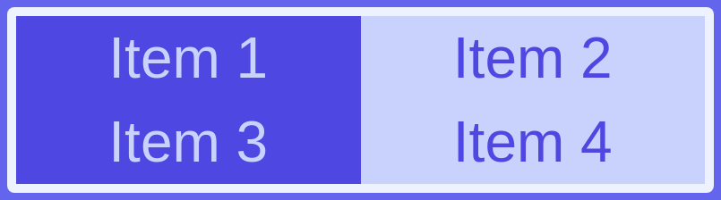
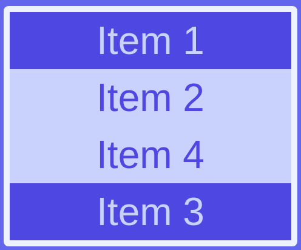

# Exercise J

Difficulty: 2

In this exercise you'll create a responsive layout for a list of items.

- You'll use media queries to apply different properties depending on the window width.
- For large screens you'll let elements be all in a row, and one of them expand to fill the space available
- For medium screens, you'll arrange the elements in two rows of two elements, each filling half of the width of the flexbox
- For small screens, you'll show one element per row, and the third element will be displayed last.

Result:

Window width larger than 900px

Window width smaller than 900 px and larger than 560 px

Window width smaller than 560px

